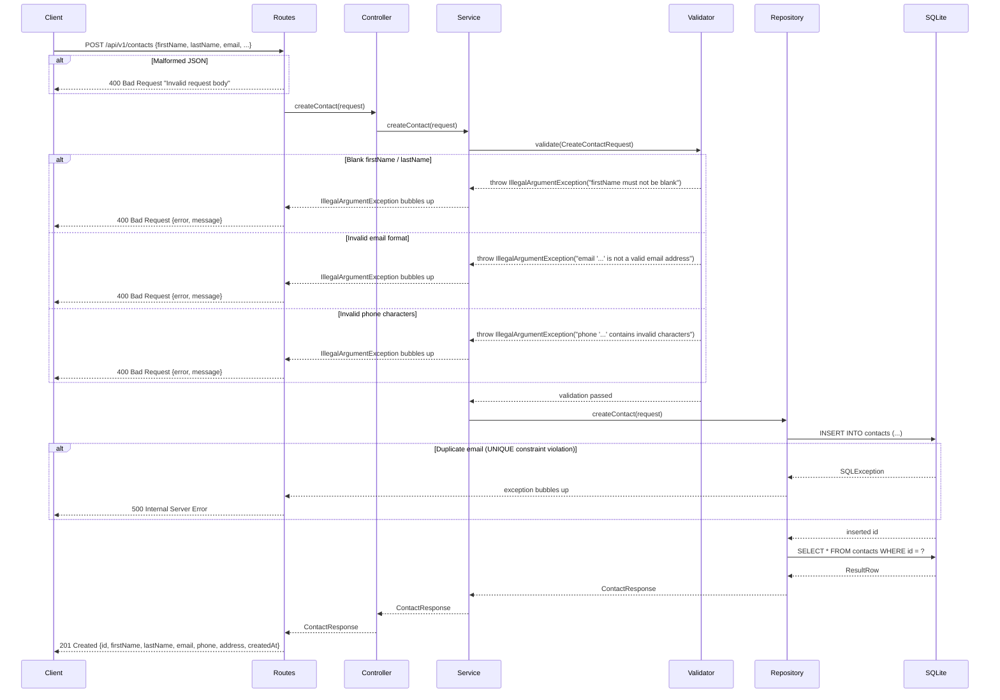
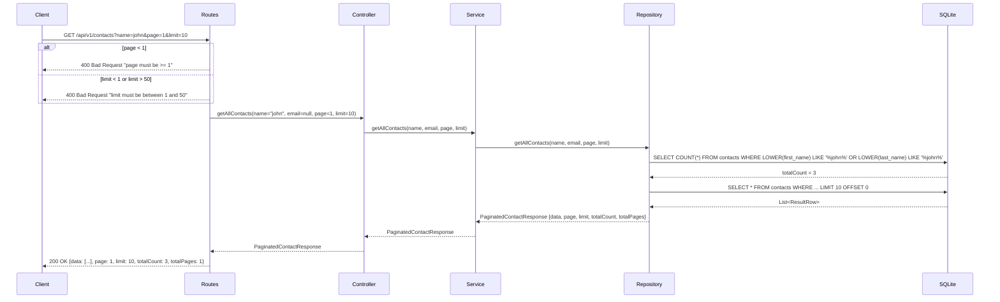
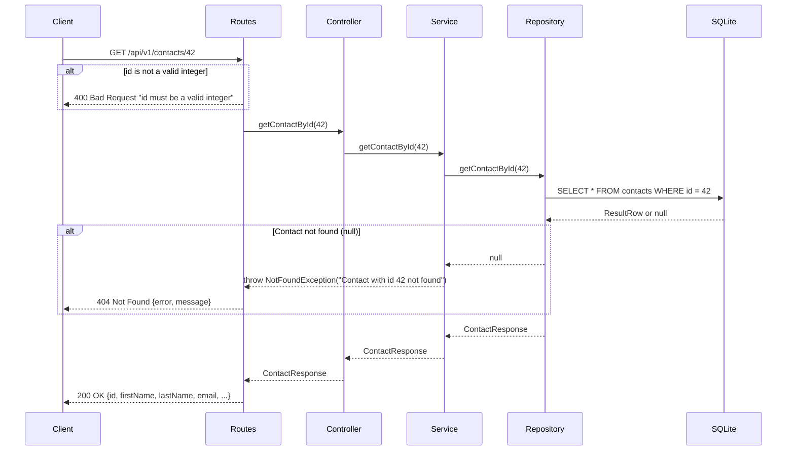
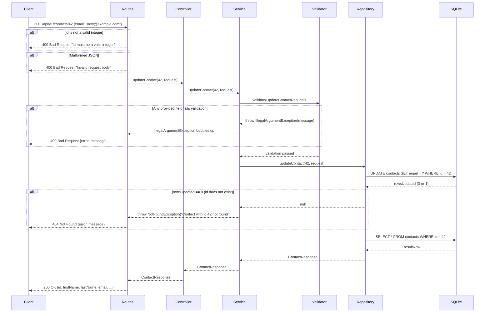
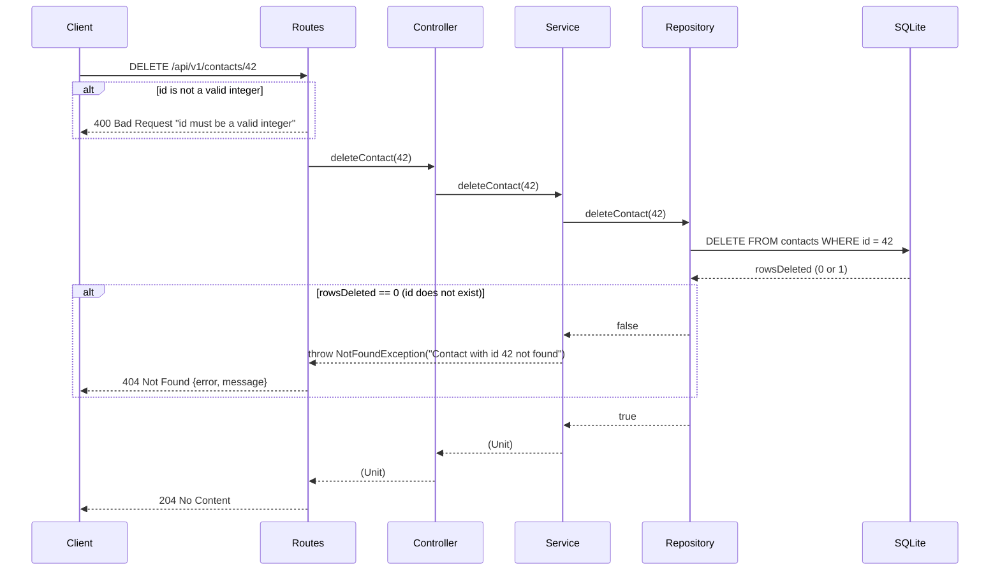

# Request Flow Diagrams

Full lifecycle diagrams for each CRUD operation across the Routes → Controller → Service → Validator → Repository → SQLite chain. Each diagram includes both the happy path and the primary failure paths.

---

## Create Contact

`POST /api/v1/contacts`

---

## Read All Contacts (with search & pagination)

`GET /api/v1/contacts?name=john&page=1&limit=10`

---

## Read Single Contact

`GET /api/v1/contacts/{id}`

---

## Update Contact

`PUT /api/v1/contacts/{id}`

---

## Delete Contact

`DELETE /api/v1/contacts/{id}`

